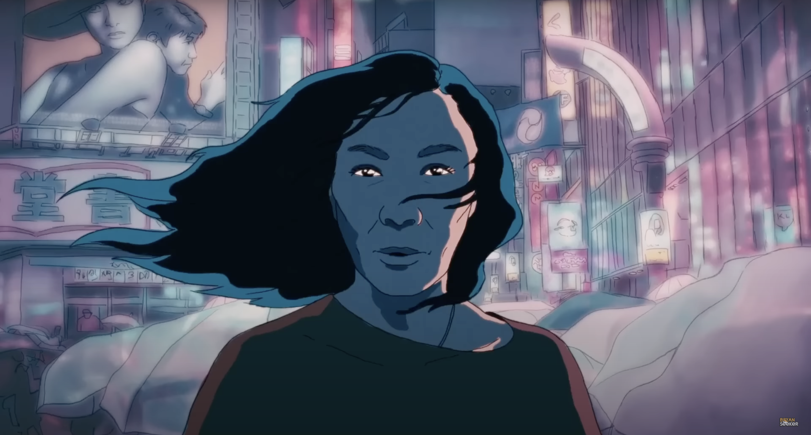

# Quiz 8 jihe0254_9103_tut7

**This quiz will be completed in two parts.**  
While introducing the `imaging techniques` and `coding techniques` that inspired me, I will also apply the markdown knowledge I have learned.
# Part 1: Imaging Technique Inspiration
My creative inspiration comes from the *Academy Award*-winning film:  
**Everything Everywhere All at Once**.

There is a Multiverse Scene in the film, while the protagonist’s point of view remains consistent, t the environments and character identities fracture across different universes, times, and spaces—shifting constantly and even transforming characters into trees, fruits, aliens, and more.

## Multiverse Scene:
|||
|-|-|
|  |  |
|  |  |
|  |  |

I’d like to incorporate this creative approach into my project: keeping a core structure or perspective constant, while allowing all other elements to change as much as possible. This contrast can create a powerful sense of visual impact and narrative surprise.

The link to the clip is as follows:  
- [Everything Everywhere All at Once](https://www.youtube.com/watch?v=vT0Y3k32QRE)  
- [Everything Everywhere All at Once - Slow Down](https://www.youtube.com/watch?v=a2v7JK8c2fk)

>Note: This clip includes a few weird or creepy moments to highlight the multiverse concept, but the overall tone of the film is not horror. Please view with discretion.

# Part 2: Coding Technique Exploration
In the official p5.js examples, there is a 3D module demonstrating the use of ***orbit Control***. This feature allows users to zoom in and out using the mouse scroll wheel or pinch gestures on a touch screen, enabling elements to expand outward or contract inward around a central point, even with 3D rotation.  

|||
|-|-|
|  |  |

I think this effect—of expanding and collapsing around a stable center—can be combined with the multiverse concept explored in Part 1. Since the design concept in Part 1 also revolves around a relatively fixed central element, this technique aligns well with the overall structure.

The link to this example:  [**Orbit Control**](https://p5js.org/examples/3d-orbit-control/)

This technique might be worth experimenting with in relation to my concept, as it could help enrich the visual dynamics.

# Summary & Reflection
**These are some of my initial thoughts. As the project progresses, I will continue to explore and learn new techniques, adjusting my direction along the way to refine and improve the final outcome.**

